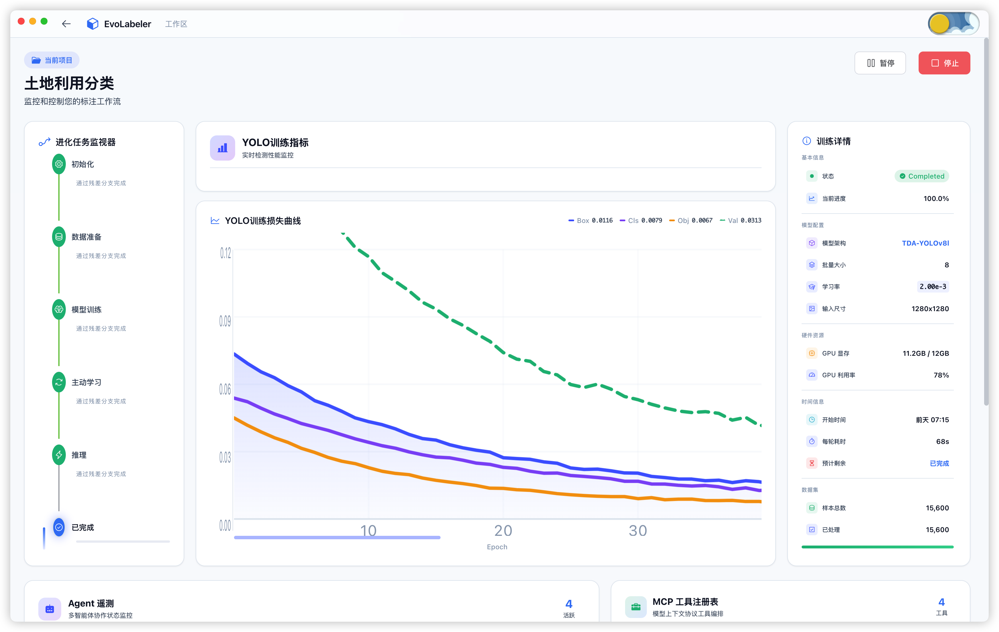
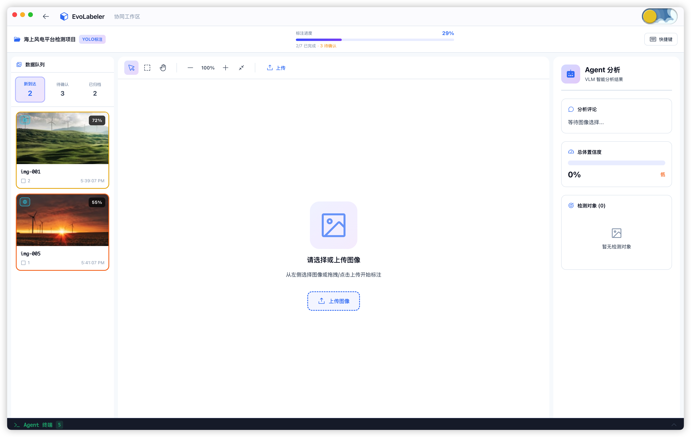

# EvoLabeler - AI Agent Driven MLOps Engine

<div align="center">


**🚀 Self-Evolving MLOps Engine for Remote Sensing Object Detection Based on Multi-Agent Collaboration**

[](https://opensource.org/licenses/MIT)
[](https://www.python.org/)
[](https://fastapi.tiangolo.com/)
[](https://vuejs.org/)
[](https://www.electronjs.org/)
[](CONTRIBUTING.md)

[English](README_EN.md) | [中文文档](README.md)

</div>

---

## 📖 Introduction

**EvoLabeler** is an innovative MLOps system based on the **IDEATE (Iterative Data Engine via Agentic Task Execution)** framework, implementing fully automated closed-loop remote sensing image object detection through multi-agent collaboration.

### 🎯 Key Features

- **🤖 Multi-Agent Architecture**: 4 specialized agents working collaboratively
- **🔄 Automated Closed-Loop**: Fully automated from data upload to model training
- **🧠 LLM-Driven Decision Making**: Intelligent analysis and strategy planning
- **🌐 Active Learning**: Entropy-based uncertainty quantification and intelligent sample selection
- **📊 Semi-Supervised Learning**: High-quality pseudo-labeling with quality scoring
- **📚 Curriculum Learning**: Difficulty-sorted training (easy to hard)
- **🔗 Residual Architecture**: Information preservation and parallel execution
- **🎨 Co-Pilot Workspace**: Data stream management, smart canvas with advanced annotation tools, agent analysis, live terminal
- **🖼️ Smart Annotation**: Real zoom support (0.25x-5x), image upload, YOLO/JSON export, multi-tool editing
- **📦 Dataset Import**: Batch import of pre-annotated datasets in YOLO/JSON formats
- **🏗️ Modular Architecture**: Composables + sub-components, high maintainability design
- **📊 Project-Specific Data**: Independent training metrics and configurations for each project
- **📸 Smart Thumbnails**: Auto-generate project covers from first uploaded image

---

## 🔬 Core Algorithms & Academic Innovation

### Active Learning

Entropy-based uncertainty quantification for intelligent sample selection:

```python
# Entropy calculation: H = -Σ p(x) * log(p(x))
def calculate_entropy(confidence: float) -> float:
    if confidence <= 0 or confidence >= 1:
        return 0.0
    p, q = confidence, 1 - confidence
    return -(p * math.log2(p) + q * math.log2(q))

# Active learning decision
requires_more_data = (
    uncertainty_score > 0.3 or       # Uncertainty threshold
    low_confidence_ratio > 0.2 or    # Low confidence ratio
    boundary_sample_ratio > 0.2      # Boundary sample ratio
)
```

### Semi-Supervised Learning

Pseudo-labeling + Quality Assessment + Curriculum Learning pipeline:

```python
# Quality scoring formula
quality_score = (
    0.5 * avg_confidence +           # Average confidence
    0.3 * high_confidence_ratio +    # High confidence ratio
    0.2 * consistency_score          # Consistency score
)

# Curriculum learning sorting (easy to hard)
sorted_samples = sort_by_quality(pseudo_labels, descending=True)
```

### Weakly Supervised Fine-tuning

Optimized training strategy for pseudo-labels:

```python
weak_supervision_config = {
    "pseudo_label_weight": 0.3,      # Pseudo-label loss weight
    "confidence_weighted": True,      # Confidence-weighted loss
    "min_confidence": 0.5,           # Minimum confidence threshold
}
```

---

## 🏗️ System Architecture

```
┌─────────────────────────────────────────────────────────────┐
│                  Frontend (Electron Desktop)                │
│       Vue3 + TypeScript + GSAP + Element Plus               │
│   Project Dashboard | Workspace Monitor | Co-Pilot Workspace│
│   Data Stream | Smart Canvas (Zoom/Upload/Export) | Agent Panel│
└────────────────────────┬────────────────────────────────────┘
                         │ REST API
┌────────────────────────▼────────────────────────────────────┐
│                    Backend (FastAPI)                        │
│ ┌─────────────────────────────────────────────────────────┐ │
│ │       AdvancedJobOrchestrator (Orchestration Layer)     │ │
│ │  Residual Connections | Parallel Execution | Feedback   │ │
│ └─────────────────────────────────────────────────────────┘ │
│ ┌────────┬──────────┬──────────────┬────────────┐          │
│ │Inference│Analysis │Acquisition   │Training    │  Agents  │
│ │Agent   │Agent    │Agent         │Agent       │          │
│ │Active  │LLM      │Semi-Supervised│Curriculum  │          │
│ │Learning│Decision │Learning      │Learning    │          │
│ └────────┴──────────┴──────────────┴────────────┘          │
│ ┌────────┬──────────┬──────────────┬────────────┐          │
│ │Supabase│QwenAPI  │WebCrawler    │Subprocess  │  Tools   │
│ │Client  │Wrapper  │(Playwright)  │Executor    │          │
│ └────────┴──────────┴──────────────┴────────────┘          │
│ ┌─────────────────────────────────────────────────────────┐ │
│ │                    MCP Tool Registry                    │ │
│ │  Scene Classification | Keyword Optimization | Quality  │ │
│ └─────────────────────────────────────────────────────────┘ │
└─────────────────────────────────────────────────────────────┘
                         │
┌────────────────────────▼────────────────────────────────────┐
│              External Services / Storage                    │
│   Supabase DB  |  Qwen API  |  YOLO Scripts  |  Storage    │
└─────────────────────────────────────────────────────────────┘
```

---

## 🔬 Workflow

### Complete Pipeline

```
User Upload ZIP
    ↓
[UPLOAD] Extract & Validate
    ↓
[INFERENCE] Model Inference (Residual)
    ├─ Detection Results
    ├─ Uncertainty Assessment (Entropy Calculation)
    └─ Active Learning Signals (High-Value Sample Detection)
    ↓
[ANALYSIS] VLM+LLM Analysis (Residual + Parallel)
    ├─ Scene Classification (MCP Tools)
    ├─ Semantic Extraction
    ├─ Search Strategy Generation
    └─ Intelligent Decision (Data Acquisition Needed?)
    ↓
[Conditional Branch] Based on Active Learning Signals
    ├─ Yes → [ACQUISITION]
    │         ├─ Web Crawling (Playwright)
    │         ├─ Pseudo Labeling (Semi-Supervised)
    │         ├─ Quality Scoring (Multi-dimensional)
    │         └─ Diversity Filtering
    │         ↓
    │      [Quality Check] (Feedback Loop)
    │         ├─ Pass → Continue
    │         └─ Fail → Supplement/End
    │
    └─ No → Skip Acquisition
    ↓
[TRAINING] Model Training (Residual)
    ├─ Curriculum Learning Sorting (Easy to Hard)
    ├─ Weakly Supervised Fine-tuning Config
    ├─ Adaptive Training Parameters
    └─ Training Monitoring
    ↓
[COMPLETE] Done

### Key Academic Concepts

| Concept | Implementation | Core Algorithm |
|---------|---------------|----------------|
| **Active Learning** | InferenceAgent | Entropy uncertainty, boundary sample detection |
| **Semi-Supervised Learning** | AcquisitionAgent | Pseudo-labeling, quality scoring |
| **Curriculum Learning** | TrainingAgent | Difficulty sorting, phased training |
| **Weakly Supervised Fine-tuning** | TrainingAgent | Confidence-weighted loss, adaptive params |
| **LLM Decision** | AnalysisAgent | Intelligent data acquisition decision |
| **Residual Connection** | AdvancedOrchestrator | Information preservation |
```

## 🚀 Quick Start

### Prerequisites

- Python 3.13+
- Node.js 18+
- Poetry (Python package manager)
- Supabase Account
- Qwen API Key (SiliconFlow)

### Installation

```bash
# 1. Clone the repository
git clone https://github.com/Ryder-MHumble/EvoLabeler-AIAgent-MLOps.git
cd EvoLabeler-AIAgent-MLOps

# 2. Install backend dependencies
cd backend
poetry install
poetry run playwright install

# 3. Configure environment
cp .env.example .env
# Edit .env with your API keys

# 4. Initialize database
# Run in Supabase SQL Editor: backend/app/db/migrations/002_create_projects_table.sql
poetry run python scripts/insert_test_projects.py

# 5. Start backend service
poetry run python run.py
```

### Start Frontend

#### Development Mode

```bash
# 1. Navigate to frontend directory
cd ../evolauncher-frontend

# 2. Install dependencies
npm install

# 3. Start Electron application
npm run electron:dev
```

#### Build Production Version

**Method 1: One-Click Build (Recommended)**

```bash
cd evolauncher-frontend/scripts
./build-app.sh
```

**Method 2: Manual Build**

```bash
cd evolauncher-frontend

# 1. Generate app icons
cd scripts
./create-icons.sh
cd ..

# 2. Build the application
npm run build:mac
```

**Build Output Location**:
```
evolauncher-frontend/
└── release/
    ├── EvoLabeler-1.0.0-arm64.dmg    # Apple Silicon version
    ├── EvoLabeler-1.0.0.dmg          # Intel version
    └── mac/
        └── EvoLabeler.app
```

**First-Time Run Tips**:

macOS may show a security warning (unsigned app). To resolve:
- Right-click EvoLabeler.app → Select "Open" → Click "Open" button
- Or use command: `xattr -cr /Applications/EvoLabeler.app`

### Access Services

- **Backend API Docs**: http://localhost:8000/docs
- **Health Check**: http://localhost:8000/health
- **Frontend**: Electron window opens automatically

---

## 📸 Application Screenshots

<table>
  <tr>
    <td align="center"><b>Dashboard - Project Management</b></td>
    <td align="center"><b>Workspace Monitor - Training Details</b></td>
    <td align="center"><b>Co-Pilot Workspace - Smart Annotation</b></td>
  </tr>
  <tr>
    <td></td>
    <td></td>
    <td></td>
  </tr>
  <tr>
    <td align="center"><i>Project cards, system metrics, GSAP animation effects</i></td>
    <td align="center"><i>Evolution task monitor, YOLO metrics, loss curves, agent telemetry</i></td>
    <td align="center"><i>Data stream management, smart canvas, annotation tools, agent analysis, live terminal</i></td>
  </tr>
</table>

---

## 🛠️ Tech Stack

### Backend

- **Framework**: FastAPI 0.115
- **Database**: Supabase (PostgreSQL)
- **LLM/VLM**: Qwen API (SiliconFlow)
- **Web Scraping**: Playwright
- **Validation**: Pydantic V2
- **Async**: asyncio

### Frontend

- **Desktop**: Electron 28
- **Framework**: Vue 3.4 (Composition API)
- **Build Tool**: Vite 5.0
- **UI Library**: Element Plus 2.5
- **Animation**: GSAP 3.12
- **Styling**: Tailwind CSS + SCSS
- **State Management**: Pinia 2.1
- **Routing**: Vue Router 4.2
- **i18n**: Vue I18n 9.9

---

## 📖 Documentation

### Backend
- [API Documentation](backend/docs/API.md)
- [Architecture Design](backend/docs/ARCHITECTURE.md)
- [Database Design](backend/app/db/DATABASE_DESIGN.md)
- [Project Management](backend/docs/PROJECT_MANAGEMENT.md)

### Frontend
- [Frontend README](evolauncher-frontend/README.md)
- [Quick Start Guide](evolauncher-frontend/QUICKSTART.md)
- [Co-Pilot Workspace Features](evolauncher-frontend/CO_PILOT_FEATURES.md)

### Key Features Highlights

**Smart Canvas Annotation System (Refactored & Optimized):**
- ✅ **Real Zoom Sync**: Bounding boxes perfectly follow image zoom and pan (0.25x - 5x)
- ✅ **Image Management**: Drag/click upload, queue selection, clear to return to upload state
- ✅ **Dataset Import**: Batch import YOLO format (.txt) and JSON pre-annotated datasets
- ✅ **Annotation Export**: YOLO format (txt + classes.txt) and JSON format supported
- ✅ **Multi-tool Editing**: Select (V), Draw (B), Pan (H) tools
- ✅ **Full Shortcuts**: V/B/H for tools, +/- for zoom, 0 for reset, Space to confirm, Del to delete
- ✅ **Precise Editing**: 8 resize handles, drag to move, label selection, batch confirm

**Modular Architecture Design:**
- 📦 **Composables**: useCanvas, useAnnotation, useImageUpload, useDatasetImport, useAnnotationExport
- 🎨 **Sub-components**: CanvasToolbar, AnnotationEditor, AnnotationOverlay, ImageInfoBar, EmptyCanvas
- 🛠️ **Utilities**: Annotation parsing/export, confidence calculation, file download
- 📝 **Constants**: Tool types, zoom config, label options, color mappings
- 🔧 **Maintainability**: Refactored from 1866-line monolith to modular architecture for better code clarity

**Project-Specific Data Management:**
- ✅ Independent training data and metrics for each project
- ✅ Configurable model architectures (YOLO v5-11, TDA-YOLO)
- ✅ Independent training parameters (batch size, learning rate, input size)
- ✅ Real-time hardware resource monitoring (GPU memory, utilization)
- ✅ Dynamic training progress and metric trends
- ✅ Configurable loss curve convergence characteristics

**Project Creation Wizard:**
- ✅ Four-step guided creation process
- ✅ Batch image upload support
- ✅ Automatic thumbnail generation from first uploaded image
- ✅ Multiple YOLO model selection (YOLOv5-11, TDA-YOLO)
- ✅ Flexible model size configuration (Nano to XLarge)
- ✅ Optional custom pre-trained weights upload

---

## 📄 License

This project is licensed under the MIT License - see the [LICENSE](LICENSE) file for details.

---

## 🙏 Acknowledgments

- FastAPI Team
- Supabase Community
- SiliconFlow API
- Playwright Project
- All open-source contributors

---

<div align="center">

**Made with ❤️ by Ryder Sun**

If you find this project helpful, please consider giving it a ⭐!

</div>

