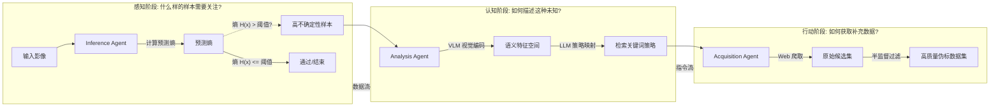

```mermaid
graph LR
    subgraph Perception ["感知阶段: 什么样的样本需要关注?"]
        Input["输入影像"] --> Infer["Inference Agent"]
        Infer -- "计算预测熵" --> Entropy["预测熵"]
        Entropy -. "熵 H(x) > 阈值?" .-> HighUncert["高不确定性样本"]
        Entropy -- "熵 H(x) <= 阈值" --> Pass["通过/结束"]
    end

    subgraph Cognition ["认知阶段: 如何描述这种未知?"]
        HighUncert --> Analyze["Analysis Agent"]
        Analyze -- "VLM 视觉编码" --> Semantic["语义特征空间"]
        Semantic -- "LLM 策略映射" --> Strategy["检索关键词策略"]
    end

    subgraph Action ["行动阶段: 如何获取补充数据?"]
        Strategy --> Acquire["Acquisition Agent"]
        Acquire -- "Web 爬取" --> RawData["原始候选集"]
        RawData -- "半监督过滤" --> CleanData["高质量伪标数据集"]
    end

    Perception -- "数据流" --> Cognition
    Cognition -- "指令流" --> Action
```